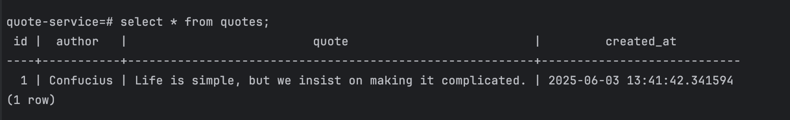
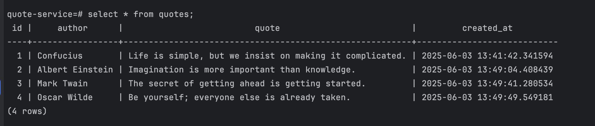
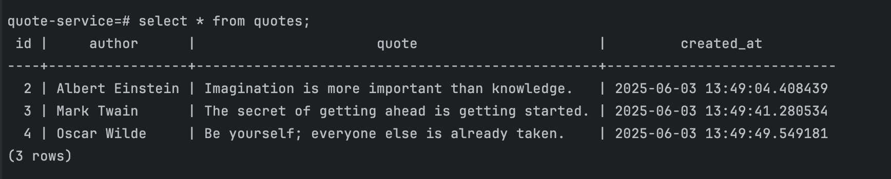

# **Мини-сервис «Цитатник»**

Сервис, предназначенный для хранения и управления коллекцией цитат. Он позволяет добавлять новые цитаты, получать все цитаты или случайную, фильтровать их по автору и удалять по идентификатору. Сервис реализует простой и удобный интерфейс для работы с цитатами, обеспечивая быстрый доступ к данным и возможность их управления через стандартные HTTP-запросы.
### Основные возможности сервиса: ###
- Добавление цитат с указанием автора и текста.
- Получение полного списка цитат.
- Получение случайной цитаты.
- Фильтрация по автору.
- Удаление цитаты по ID.


## Используемые технологии:

- PostgreSQL (в качестве хранилища данных)
- Docker (для запуска сервиса)
- golang-migrate/migrate (для миграций БД)
- net/http (для реализации HTTP-сервера и обработки запросов)
- pgx (драйвер для работы с PostgreSQL)
- golang/mock, testify (для тестирования)

## Запуск
- Перед запуском необходимо ввести команду `go mod vendor`
- Запустить сервис можно с помощью команды `make deploy`
- Останавливает и удаляет развернутое окружение Docker вместе с его образами `make rollback`
- Для запуска unit-тестов необходимо выполнить команду `make unit_test`
- Для запуска тестов с покрытием `make cover` и `make cover-html` для получения отчёта в html формате
- Для запуска интеграционных тестов необходимо выполнить команду `make integration_tests`
- Для запуска линтера необходимо выполнить команду `make lint`


## Примеры запросов

- [Добавление цитаты](#add-quote)
- [Получение всех цитат](#get-quotes)
- [Получение случайной цитаты](#random-quotes)
- [Фильтрация по автору](#filter-by-author)
- [Удаление цитаты по ID](#delete-quote)


### Добавление цитаты <a name="add-quote"></a>
```
curl -X POST http://localhost:8080/quotes \
  -H "Content-Type: application/json" \
  -d '{"author":"Confucius", "quote":"Life is simple, but we insist on making it complicated."}'
```

Пример ответа:
```
{
  "id": 1
}
```
Вывод в таблице `quotes`:



### Получение всех цитат <a name="get-quotes"></a>
Для демонстрации работы данного функционала добавим несколько цитат и выполним запрос на получение всех сохранённых цитат.

``` 
curl http://localhost:8080/quotes
```

Пример ответа:

``` 
[
  {
    "ID": 4,
    "Author": "Oscar Wilde",
    "Quote": "Be yourself; everyone else is already taken.",
    "CreatedAt": "2025-06-03T13:49:49.549181Z"
  },
  {
    "ID": 3,
    "Author": "Mark Twain",
    "Quote": "The secret of getting ahead is getting started.",
    "CreatedAt": "2025-06-03T13:49:41.280534Z"
  },
  {
    "ID": 2,
    "Author": "Albert Einstein",
    "Quote": "Imagination is more important than knowledge.",
    "CreatedAt": "2025-06-03T13:49:04.408439Z"
  },
  {
    "ID": 1,
    "Author": "Confucius",
    "Quote": "Life is simple, but we insist on making it complicated.",
    "CreatedAt": "2025-06-03T13:41:42.341594Z"
  }
]
 ```
Вывод в таблице `quotes`:




### Получение случайной цитаты <a name="random-quotes"></a>

``` 
curl http://localhost:8080/quotes/random
```
Пример ответа:

```
{
  "ID": 3,
  "Author": "Mark Twain",
  "Quote": "The secret of getting ahead is getting started.",
  "CreatedAt": "2025-06-03T13:49:41.280534Z"
}
 ```


### Фильтрация по автору <a name="filter-by-author"></a>
```
curl "http://localhost:8080/quotes?author=Confucius"
```

Пример ответа:

```
[
  {
    "ID": 1,
    "Author": "Confucius",
    "Quote": "Life is simple, but we insist on making it complicated.",
    "CreatedAt": "2025-06-03T13:41:42.341594Z"
  }
]
```
### Удаление цитаты по ID <a name="delete-quote"></a>
```
curl -X DELETE http://localhost:8080/quotes/1
```

Вывод в таблице `quotes` после удаления цитаты по `id = 1`:


### Unit-тесты

Для тестирования методов бизнес-логики (internal/application) и API (internal/facade) были добавлены табличные тесты.

Для запуска 
```
make unit_test
```

Вывод:

```
ok      github.com/azaliaz/quote-service/internal/application/tests     0.413s
ok      github.com/azaliaz/quote-service/internal/facade/rest/tests     0.581s
```

### Интеграционные тесты

Для тестирования методов слоя хранилища были добавлены интеграционные тесты.
Для запуска
```
make integration_tests
```

Вывод:

```
--- PASS: TestQuoteRepositorySuite (2.19s)
    --- PASS: TestQuoteRepositorySuite/TestAddQuoteAndGetAllQuotes (0.06s)
    --- PASS: TestQuoteRepositorySuite/TestDeleteQuote (0.05s)
    --- PASS: TestQuoteRepositorySuite/TestGetAllQuotes_Empty (0.04s)
    --- PASS: TestQuoteRepositorySuite/TestGetQuotesByAuthor (0.05s)
    --- PASS: TestQuoteRepositorySuite/TestGetQuotesByAuthor_Empty (0.05s)
    --- PASS: TestQuoteRepositorySuite/TestGetRandomQuote (0.04s)
    --- PASS: TestQuoteRepositorySuite/TestGetRandomQuote_Empty (0.04s)
PASS
ok      github.com/azaliaz/quote-service/internal/storage/tests (cached)
```


### Конфигурация линтера

Был добавлен линтер для проверки качества кода.